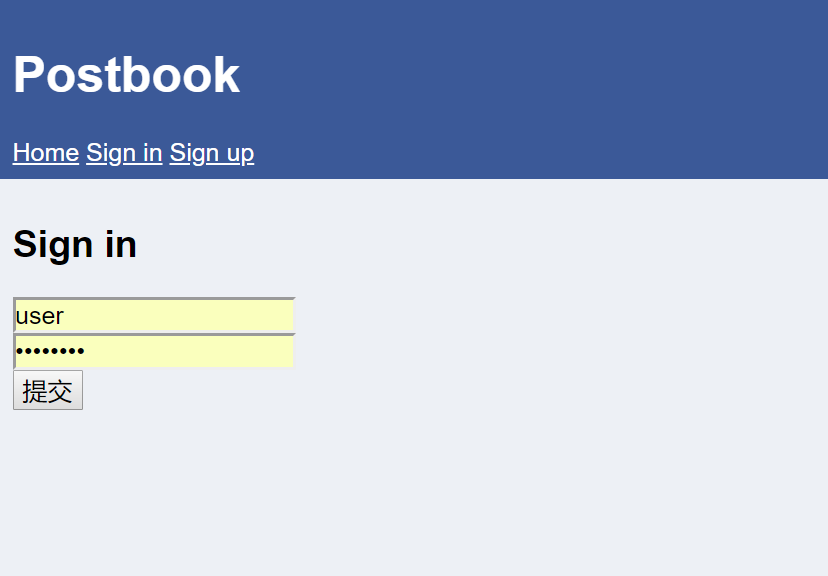
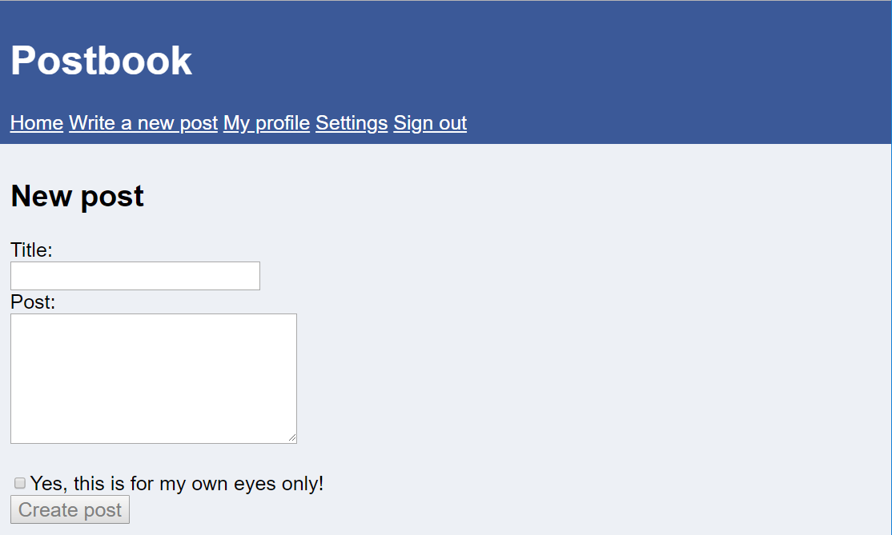
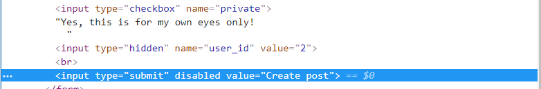
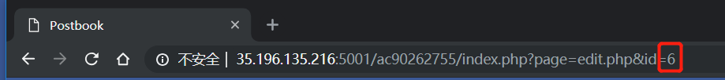
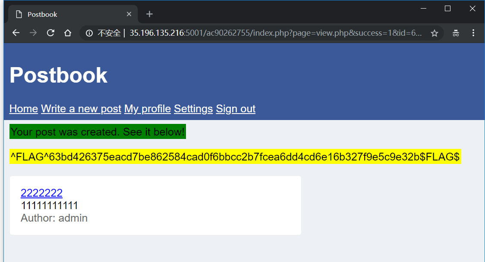
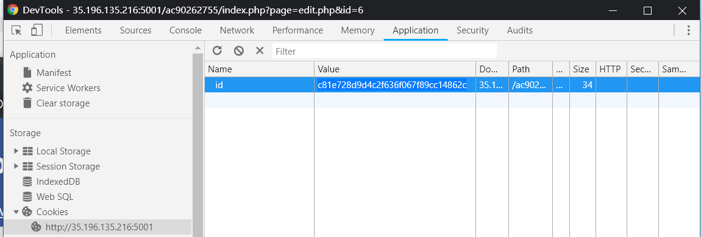
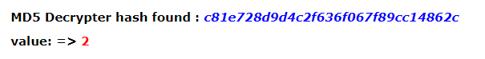
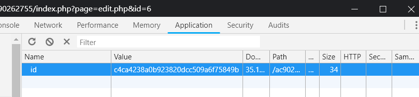

> 一个多用户文章管理系统，可注册和登陆用户，编辑和删除文章

## Flag0

- The person with username "user" has a very easy password...

提示用户“user”用了一个非常简单的密码，猜一下，猜不到就用Burpsuit的弱口令字典跑一下，成功得到password，得到FLAG

## Flag1

- Try viewing your own post and then see if you can change the ID

可以查看自己的文章，那我们把文章ID换成别的试一下，可以直接通过ID查看别人私密文章了，得到第二个FLAG

## Flag2

- You should definitely use "Inspect Element" on the form when creating a new post

新建一个Post，`Create Post`按钮不可用

没关系，浏览器查看元素，把`disabled`删除就可以提交了，得到FLAG

## Flag3 

- 189 * 5

189*5 = 945，那随便猜一下，会不会有ID为945的post，呃，真的有，而且还获得了FLAG

## Flag4

- You can edit your own posts, what about someone else's?

编辑别人的文章试试

现在登陆账号是user，编辑一个admin的文章，id为6的

提交，获得FLAG

## Flag5

- The cookie allows you to stay signed in. Can you figure out how they work so you can sign in to user with ID 1?

看一下cookie，发现id的值为 `c81e728d9d4c2f636f067f89cc14862c`

先google搜一下字符串这个看看，是`2`的md5值, 和user的用户id值2是一致的

把Cookie改成1的md5:`c4ca4238a0b923820dcc509a6f75849b`重新刷新页面，登录名是admin了，得到FLAG

## Flag6 

- Deleting a post seems to take an ID that is not a number. Can you figure out what it is?

看一下删文章的的请求，`/index.php?page=delete.php&id=c81e728d9d4c2f636f067f89cc14862c`

id不是原来的数字2，是2的md5，现在删一个别的账号的文章id为5的试试

`/index.php?page=delete.php&id=e4da3b7fbbce2345d7772b0674a318d5`

成功得到FLAG

