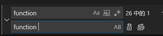
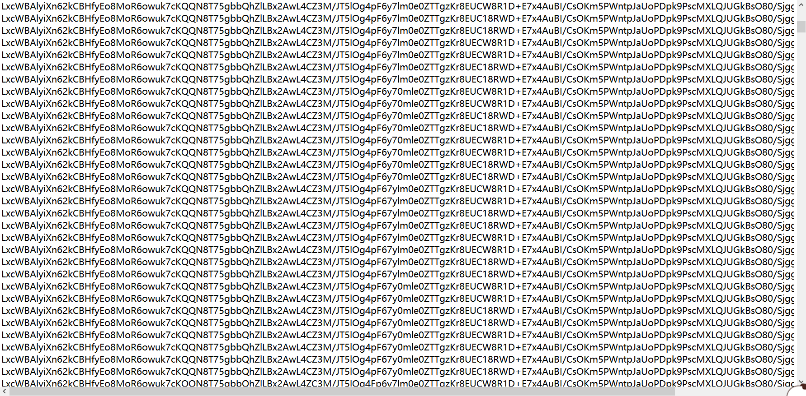

## 0x00 题目


下载附件是一个压缩包和一个Readme（如下）

压缩包内是一些svg图片


随便打开一个svg看下


## 0x01 SVG处理

这里比较简单，按顺序读出svg文件，然后把文言文的代码读出来，写了个python处理，代码如下

```python
import re

result = ''
for a in range(0,30):
    with open('part.0%02d.svg' % a, 'r') as f:
        print 'part.0%02d.svg' % a
        c = re.findall('wy-data="(.+?)"', f.read(), flags=0) # 正则取wy-data="" 包含的文字
        for aaa in c:
            result += aaa

with open('out.jj', 'w') as p:
    p.write(result)
```

文言文程序大概长这样


## 0x02 文言文转js代码

打开这个在线ide，https://ide.wy-lang.org/  把文言文代码贴左边，点compile，得到js的代码，大概如下


无法直接运行，需要修复下，里面的 function和new关键字后面缺一个空格，全盘替换下



修复之后的js文件保存为 wy.js

## 0x03 初步分析js

这是一个高度混淆过的js，初看上去毫无头绪。好在可以直接运行，先直接运行下输出一个false和一段中文


看下代码是哪里输出的信息，定位到 “天地初始” 这个函数


发现一个84长度的可疑字符串（506c6561736520696e70……..000）,进行了一些运算之后，检查 ”造化玉碟“ 的值是否和 ”一念一生“ 相同，并且打印出 ”造化玉碟”的值，就是上面看到的中文，随意修改上面的可疑字符串，发现会输出不同的中文。猜测只要修改可疑字符串为, 计算之后函数打印出true和 “一念一生” 这段中文，这个字符串很可能就是flag， 就可以解出题目，下面先来分析下 “一念一生” 这段中文

## 0x04 第一次 歌词还原

一念一生: 

> 你可曾听说过雪山悬崖曾让人魂绕梦牵传说中有宝藏在上面也藏着万丈深渊多少人为了他就此长眠却不能闭上双眼那是谁登上高高山顶让传说继续流传一段段一步步越来越近却咫尺天涯一天天一年年一遍又一遍什么都没变你以为这究竟是个传说相信的人并不多你可见过雪山洁白巍峨却闪耀金色的诱惑聪明的愚笨的善良的人还有你熟悉的人在山坡在悬崖在山顶深渊在一念之间雪花飞扬看雪

搜了下发现此为李健的一首歌，听了几遍之后没有发现什么线索

那么先看代码分析下是如何生成这段中文的， 方法 名为 “造化”，简单加了一些注释

```js
var 造化 = _ => {};
造化 = 造化种子 => {
  var 造化之数 = 0;
  var 造化金光 = {};
  var 无量造化 = "";
  造化之数 = 0;
  while (true) {
    const _ans418 = 造化之数 + 3;
    var 造化甲 = _ans418;
    const _ans419 = 造化种子.length;
    var 戌申 = false;
    if (造化甲 <= _ans419) {
      戌申 = true;
    };
    if (戌申 == 0) {
      break;
    };
    var 升腾 = _ => {};
    升腾 = 造化种子 => {
      return 扭转乾坤(造化种子, 16);  //扭转乾坤 是ParseInt，把16进制转成整型数字
    };
    var 福缘 = _ => {};
    福缘 = 造化数 => 造化 => {
      return 造化种子.substring(造化数, 造化);
    };
    const _ans420 = 造化之数 + 3;
    var 造化乙 = _ans420;
    const _ans421 = 福缘(造化之数)(造化乙);
    var 造化嫩芽甲 = _ans421;
    const _ans422 = 升腾(造化嫩芽甲);
    造化金光 = _ans422;
    var 聚光 = _ => {};
    聚光 = 光 => {
      return 大宇[光].pop(); //这里的数组“大宇”是 BASE64编码表，是中文字，注意关键代码.pop()
    };
    const _ans423 = 造化金光 % 64;
    const _ans424 = 造化金光 - _ans423;
    const _ans425 = _ans424 / 64;
    var 小六金光 = _ans425;
    const _ans426 = 聚光(小六金光);
    var 大六金光 = _ans426;
    const _ans427 = 造化金光 % 64;
    var 六四与光 = _ans427;
    const _ans428 = 聚光(六四与光);
    const _ans429 = 大六金光 + _ans428;
    const _ans430 = 无量造化 + _ans429;
    无量造化 = _ans430;
    const _ans431 = 造化之数 + 3;
    造化之数 = _ans431;
  };
  const _ans432 = 造化之数 + 1;
  var 造化丙 = _ans432;
  if (造化丙 == 造化种子.length) {
    const _ans433 = 造化之数 + 1;
    造化丙 = _ans433;
    const _ans434 = 福缘(造化之数)(造化丙);
    var 造化嫩芽乙 = _ans434;
    const _ans435 = 升腾(造化嫩芽乙);
    造化金光 = _ans435;
    const _ans436 = 造化金光 * 4;
    var 盛四金光 = _ans436;
    const _ans437 = 聚光(盛四金光);
    const _ans438 = 无量造化 + _ans437;
    无量造化 = _ans438;
  } else {
    const _ans439 = 造化之数 + 2;
    var 造化丁 = _ans439;
    if (造化丁 == 造化种子.length) {
      const _ans440 = 造化之数 + 2;
      造化丁 = _ans440;
      const _ans441 = 福缘(造化之数)(造化丁);
      var 造化树苗 = _ans441;
      const _ans442 = 升腾(造化树苗);
      造化金光 = _ans442;
      const _ans443 = 造化金光 % 4;
      var 三与光 = _ans443;
      const _ans444 = 造化金光 - 三与光;
      const _ans445 = _ans444 / 4;
      var 小二金光 = _ans445;
      const _ans446 = 聚光(小二金光);
      var 盛二金光 = _ans446;
      const _ans447 = 三与光 * 16;
      var 盛四与光 = _ans447;
      const _ans448 = 聚光(盛四与光);
      const _ans449 = 盛二金光 + _ans448;
      const _ans450 = 无量造化 + _ans449;
      无量造化 = _ans450;
    };
  };
  const _ans451 = 无量造化.length;
  var 轮回 = _ans451;
  const _ans452 = 轮回 % 4;
  轮回 = _ans452;
  if (轮回 == 2) {
    return 无量造化 + 凡尘 + 凡尘;  //base64最后的填充位，就是‘=’，这里凡尘是空字符串
  };
  if (轮回 == 3) {
    return 无量造化 + 凡尘;
  };
  return 无量造化;
};
```

这是一个base64算法，稍微不同的是先把16进制字符串转成大整数，然后进行base64编码输出,编码表长这样，总共有65个数组，对应base64编码的65个字符，后面的注释是我手工了加上标准base64表所对应的字符


根据下面的关键代码可知，生成最终的字符串时候，每次只从数组末尾取一个字，然后把这个字从数组里面移除，每个字只能用一次，比如 原来要输出的标准base64字符串是 “LPQ”,这里先输出L对应的那一行最后一个字”你“，然后把”你“字删掉，下次再输出L的时候就是“上”，依次输出PQ对应的  “的多”，最后输出完整的 “一念一生”的歌词，

>  return 大宇[光].pop();


所以这个时候需要先把中文恢复成标准的base64，然后解码看看到底是什么内容，根据上面的算法，简单写了一个逆算法把上来进行恢复base64。一开始是这么写的，遍历中文数组，如果某个数组的末尾汉字是要查找的汉字，就返回对应的标准值，在数组末尾删除这个字 (pop方法)，

```js
var 反造化 = 造A => {
  rrr = '';
  l = 造A.length;
  console.log(l);
  for (let d = 0; d < l; d++){
    for (let index = 0; index < 64; index++) {
      ccc = 大宇[index];
      ccc_length = ccc.length;
      if (ccc[ccc_length-1] == 造A[d]){
        rrr += 大大雨[index];  //大大雨是 标准base64表
        大宇[index].pop();
      };
    };
  };
  return rrr;
}
```

得到一个字符串

> LaxcnWBAldy3iqX6/Nj2kCBHJfyEo8MwoLR46ouk7cKQQu8T75gbbQhtZlBx2AwLCZMgT5lOOCRz468Fpy7l0me0ZTKTrglEUW18D+E7xJz4ABI/CsKm5BPQS8WwnpUoPDSpk9PscMXLDJUGksO0/ggjvTjxyiFKPKKc6Fs4fKe

转成整数 16进制表示

> 0x2dac5c9d604095dcb78aa5fafcd8f690204725fc84a3c330a0b478ea8ba4edc29042ef13ef981b6d086d665071d80c0b0993204f994e382473e3af05a72ee5d267b4653293ae0944516d7c0fe13bc49cf800123f0ac2a6e413d04bc5b09e95283c34a993d3ec70c5cb0c950692c3b4fe0823bd38f1ca214a3ca29ce85b387ca7

## 0x05 RSA

js已经分析了一段时间了，根据题目有提示说是基础RSA，看到两个可疑变量，注意读音， 怀疑就是N和e


但是这个是中文，程序运行时下断点，取出这两个值

> N = 0xd1bcc2c2583a355489d4df31375ee3c91e6496632a966c8fe3501692f7d3c389533f178c3ca1163eb8d0c14a9e221ee4192f83c80477a609177f0d7861b395743cd51b00703e3b3238f57263f1ee15893caa99e2b7b70a47d78c32dedd966489888e38a2d47ccd2df3d1142cdcdd7e3abdc504ac48dbab4cd5e6cbdc2ba29205
>
> e = 0x1a418b654d77d0f242ec5abfcde0451e8fd0076631d67819f53578b4fd349507e36115f43e40b7e3971c9681a6fa859fae52c66783c8ad9b6707816e5067b1e1c40ca7f840fd21c235d9ea9e81a4bb539b06ca528b3a5028f9186186b96f9f026552e74756bd3b85892ae98eebd3a0b952bd7d19d63f07c7d1eb6db093a91e95

但是只有N和e是没用的，必须知道d才能解密RSA，根据战友提供的S代码和思路，因为e非常大，很有可能可以通过Wiener attack方法解出d，试了下，真的解出了d，代码和输出如下：

```python
#coding=utf-8
from rsa_wiener_attack.RSAwienerHacker import hack_RSA
from Crypto.PublicKey import RSA

e=0x1a418b654d77d0f242ec5abfcde0451e8fd0076631d67819f53578b4fd349507e36115f43e40b7e3971c9681a6fa859fae52c66783c8ad9b6707816e5067b1e1c40ca7f840fd21c235d9ea9e81a4bb539b06ca528b3a5028f9186186b96f9f026552e74756bd3b85892ae98eebd3a0b952bd7d19d63f07c7d1eb6db093a91e95
n=0xd1bcc2c2583a355489d4df31375ee3c91e6496632a966c8fe3501692f7d3c389533f178c3ca1163eb8d0c14a9e221ee4192f83c80477a609177f0d7861b395743cd51b00703e3b3238f57263f1ee15893caa99e2b7b70a47d78c32dedd966489888e38a2d47ccd2df3d1142cdcdd7e3abdc504ac48dbab4cd5e6cbdc2ba29205
d = hack_RSA(e,n)
print 'd=',d 
# d= 74651354506339782898861455541319178061583554604980363549301373281141419821253
```

通过得到的d，尝试解密第四步里面的大整数 

> 0x2dac5c9d604095dcb78aa5fafcd8f690204725fc84a3c330a0b478ea8ba4edc29042ef13ef981b6d086d665071d80c0b0993204f994e382473e3af05a72ee5d267b4653293ae0944516d7c0fe13bc49cf800123f0ac2a6e413d04bc5b09e95283c34a993d3ec70c5cb0c950692c3b4fe0823bd38f1ca214a3ca29ce85b387ca7

顺便贴下RSA解密代码

```python
N = 0xd1bcc2c2583a355489d4df31375ee3c91e6496632a966c8fe3501692f7d3c389533f178c3ca1163eb8d0c14a9e221ee4192f83c80477a609177f0d7861b395743cd51b00703e3b3238f57263f1ee15893caa99e2b7b70a47d78c32dedd966489888e38a2d47ccd2df3d1142cdcdd7e3abdc504ac48dbab4cd5e6cbdc2ba29205
e = 0x1a418b654d77d0f242ec5abfcde0451e8fd0076631d67819f53578b4fd349507e36115f43e40b7e3971c9681a6fa859fae52c66783c8ad9b6707816e5067b1e1c40ca7f840fd21c235d9ea9e81a4bb539b06ca528b3a5028f9186186b96f9f026552e74756bd3b85892ae98eebd3a0b952bd7d19d63f07c7d1eb6db093a91e95
d = 74651354506339782898861455541319178061583554604980363549301373281141419821253

NED = (N, e, d)
decrypt_key = RSA.construct(NED)
decrypt_number = decrypt_key._decrypt(0x5ad41bfd59ee60446784c7572....)
print(decrypt_number)
print('%x' % decrypt_number)
```

发现解出来的原文并没有什么意义，可能哪里做错了

## 0x06 再次分析js

因为发现虽然好像算出来了RSA的秘钥d，但是解密出来的东西并没有任何作用，在这里卡住了很久，期间重新分析了js代码，并且对几个关键步骤进行了验证，确认了js代码的逻辑，流程图也非常简单


那么解密的思路就是 先把歌词还原成标准base64，解码base64得到一个数字B，然后RSA解密变成数字A，把数字A逆推出原始字符串，这个字符串很可能就是Flag，

## 0x07 第二次歌词还原

怀疑歌词还原成标准base64的算法有问题。发现中文码表里面有大量相同的汉字，如果需要查找的汉字 同时在多个列表的末尾，那可能会有多种结果，上次的算法 只是解出了其中的一种情况，极大概率是错误的。动态调试了一下代码，发现确实有大量的位置，有相同的汉字候选，而且因为码表是动态的（每个字只用一次，pop了一个字之后，码表就改变了）无法做按照固定位置的遍历来输出所有可能性，这时候注意到题目提示


对比了一下提示里面的字符串长度，和需要求解标准base64字符串是匹配的，并且提供了sha256, 那么可以列出所有的可能性，逐个计算sha256,就可以找到真正的字符串。思考了一下，遍历出所有的可能性可以使用一种基于决策树的搜索算法，根据提供的字符串模板，可以快速排除错误答案。在原js的环境上写了一个回溯的深度优先搜索递归算法，提示模板作为限制条件，输出所有的可能字符串

```js
const template = '*******y****2****fy****oR**********N***********L******4**3**JT***g4**6*********T*zKr8**C**R******4*******OK**PW***J****D*********Q****B**8**Sj**z**DwxS*T**jd***yl**********';

function backtrack(index, result) {
  if (index == 171){
    console.log(result)
    return true;
  };
  if (tamplate[index] != '*'){ //特殊情况有模板
    var found = false;
    var found_index = 0;
    for (let d = 0; d < 64; d++){
      var listA = 大宇[d];
      var lengthA = 大宇[d].length;
      if (一念一生[index] == listA[lengthA - 1] && tamplate[index] == 大大雨[d]){ //特殊情况根据模板返回
        found = true;
        found_index = d;
        break; //已经找到正确字符，退出本次循环
      }
    }
    if (found == true){  //找到模板，继续下一步
      大宇[found_index].pop();
      backtrack(index + 1, result + template[index]);
      大宇[found_index].push(一念一生[index]);
    }else{  //没有找到和模板对应的值，进入了错误的路径，剪枝，不用再往下试了
      // console.log('Error', index, result, tamplate[index])
      return false;
    }
  }else{ //没有模板则需要进行决策
    for (let d = 0; d < 64; d++){
      var listA = 大宇[d];
      var lengthA = 大宇[d].length;
      if ( 一念一生[index] == listA[lengthA - 1]){
        大宇[d].pop();
        backtrack(index + 1, result + 大大雨[d]);
        大宇[d].push(一念一生[index]);
      }else{
        continue;
      }
    }
  }
}
```

输出的结果正好是 1024个，如下，这里任何一个都可以转换成 “一念一生”

逐个求sha256，和题目提示的进行对比

```python
import hashlib

with open('base64-results.txt', 'r') as fi:
    for line in fi.readlines():
        line = line[:-1] +'='
        hash_256 = hashlib.sha256(line)
        hash_256_value = hash_256.hexdigest()
        if hash_256_value == '2348cd09e1624d34542806545906f2054a18036ce8a1cbe0ed5b0e4869bee5c2':
            print(line)
```

得到正确的base64字符串

> LxnWBAlyiXc62kCBHfyEo8woR6oMuk7cKQQN8T75gbbQtZlLBx2AwL4CZ3M/JT5lOg4Fp6y70mle0ZTTgzKr8EUCW8R1D+E7x4AuBI/CsOKm5PWnhpJaUoPDpk9PscMXLQJUGkBsO80/SjggzjvDwxSiTqFjdKPKylKc6F4fKes=

然后 进行RSA解密，得到一个整数

> 0x222021b2311dfdddbdfdf1df31dc3dddfdbddc3dfdf1df3c3f21df321c3ddf31f1df221f3dfdfdddb2213

## 0x08 反译整数

这个整数是怎么生成的呢? 看js代码

```js
var 虚空译 = function 虚空译(虚) {  //虚 输入的字符串
  /*=_=>{};var */
  垃圾箱 = undefined;
  this["间"] = 0;
  this["虚"] = 0;
  const _ans365 = 虚.length;
  var 虚長 = _ans365;
  var 始 = 0;
  while (true) {
    const _ans366 = 虚長 - 1;  //从字符串最后一位开始
    虚長 = _ans366;
    if (虚長 < 0) {            //字符串遍历结束
      break;
    };
    const _ans367 = 等价交换(虚)(虚長);  //关键函数 等价交换 返回的是一个数字0-35
    var 实 = _ans367;
    if (始 == 0) {  
      var 己申 = this["间"];
      const _ans369 = 赋(this)(己申)(实);  //第一位（最低位）先赋上值
      this["间"] = this["间"] + 1;
    } else {
      if (始 < 25) {
        var 乙地 =  this["间"];
        var 癸戌 = this[乙地 - 1];
        var 实始 = 实 * 翻番(始);
        this[乙地 - 1] = 癸戌 | 实始;
      };
    };
    const _ans376 = 始 + 4;  
    const _ans377 = _ans376 % 28; // 0->4->8->12->16-20->24->0
    始 = _ans377;
  };
  const _ans378 = this.理();  //
};
```

这是一个用字符串表示大整数的算法，简单解释下，接收下表范围内的字符串，每一个字符代表一个 0-35（10进制）的数字（下标）

> abcdefghijklmnopqrstuvwxyz0123456789

比如a代表0，d代表3, 0代表26

把每个字符当成16进制的一位填入到16进制的模板里面，因为16进制每位只能填0-f 16个数，这里有36个数，一定存在溢出，溢出（进位）的部分和上一位取 ‘或’ 运算，下面字符串 c5y8就表示数字 0x3F82


根据这个规则，如果知道结果3F82，要倒推原文的话，先看最低位2，这时候会有三种可能的16进制下标（2,12,22），可能有三种结果，但是因为第二位是偶数，所以排除12这种可能，依此类推，每个位置上都有1-2种可能性，字符串长度是84，所以总共可能有 2^84种结果，不管了，先把算法写出来，试着跑一下，然后再考虑如何优化。下面是运行时的截图


跑了10几分钟 程序都没停，结果数量太大，需要去加一些限制条件，优化算法。一边调程序一边看这满屏幕的结果，突然发现结果里面有一些固定位置上是 ‘2d’ ，url编码 %2d不就是 ‘-’号吗，脑洞大开，如果再把这个字符每隔两位添加%,再urldecode一下。修改代码再跑一把，在增加限制条件 输出的字符串格式应该为 类似这样 flag{xxxxx-xxxx-xxx-xxx-xxxxxx}

## 0x09 出flag

重新修改下程序，把一些位置固定住，这样可能的结果就变得比较少了，再根据Readme内提示，逐个取 sha256

程序运行之后就去睡觉了，这是运行中的截图


第二天早上起来，得到flag


## 0x0a 总结

简单总结下，本题的考点主要有

1. 文言文转js， 比较简单，多用搜索引擎即可
2. 基础rsa，e很大或者很小的时候可以破解出d
3. 反推字符串，第一次是base64的，第二次是字符串转数字的，最后的反推算法写的不太好，运行时间过长，就不拿出来了，期待大佬写出最佳的算法
4. 一些想象力，看到2d想到是’-‘