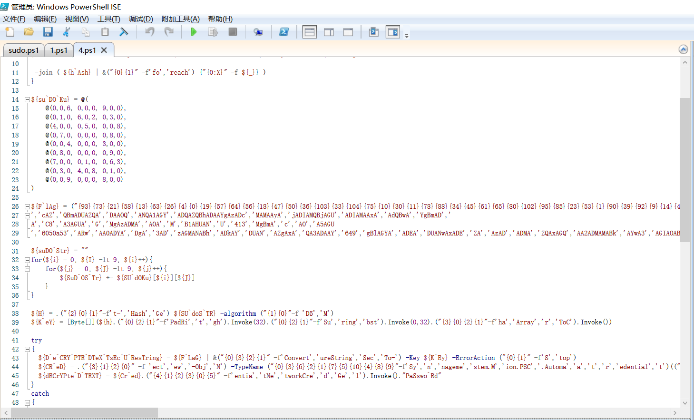

## 0x00 题目

题目打开是一个 sudo.ps1，powershell脚本，用ISE打开之

选中末尾的代码运行下，猜测应该是‘iex’，果然如此

这是把|前面的输出字符串执行的意思

## 0x01 解密代码

我们把结尾|后面的代码换成 “Out-File 1.txt”，获得第一层解密的代码保存为 1.ps1吧

相同的方法把末尾的 ‘iex’ 改成输出到文件，这样替换了几次之后得到下面这样的一段代码

代码中间一段是一个未完成的数独，猜测只要解出数独就能得到flag，找了一个在线解数独的网站，发现这个数独非唯一解。

## 0x02 解数独

那就网上找一段代码解数独吧，原来有340个解。那就把这340个解代入原来的代码，跑一下试试。把原来的代码稍微改一下，套个循环，依次执行。

直接跑出flag

