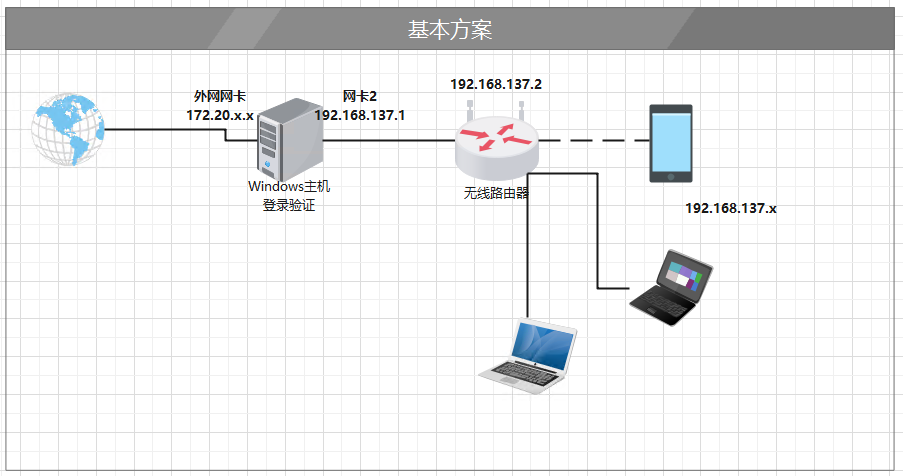
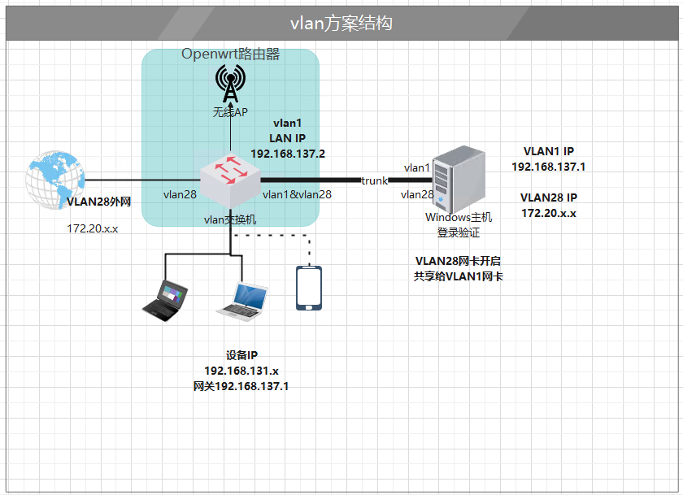
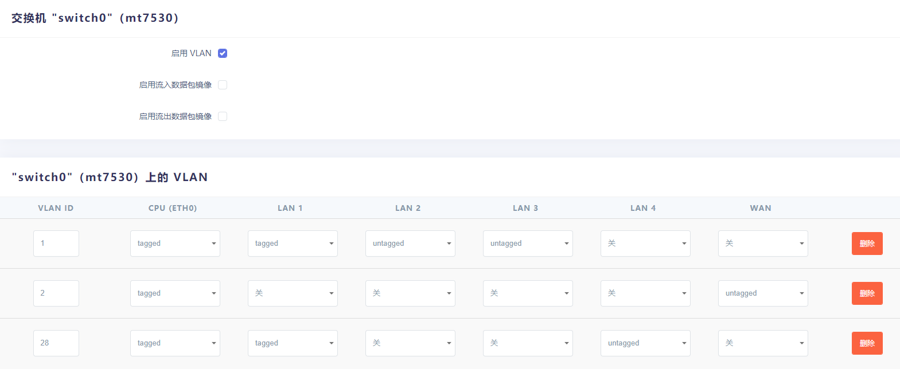
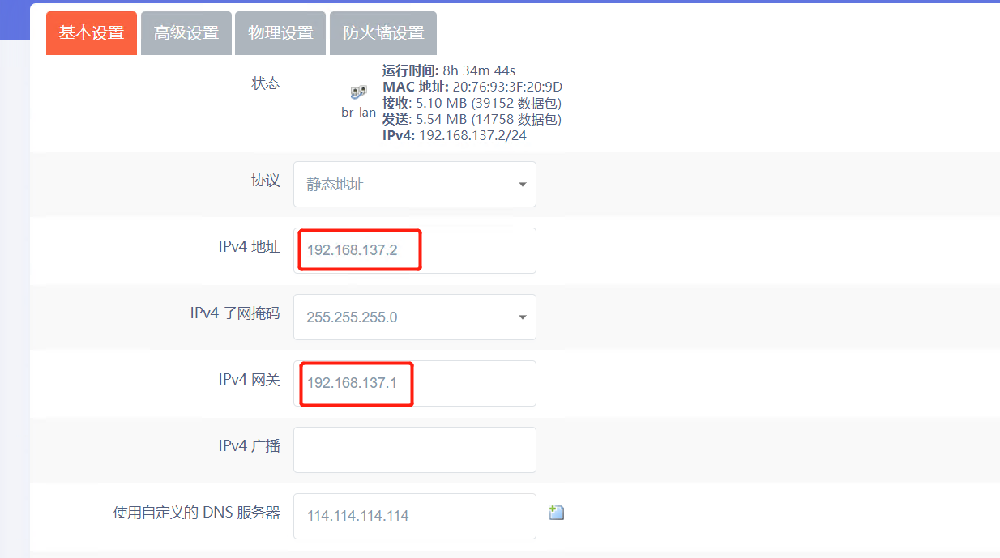
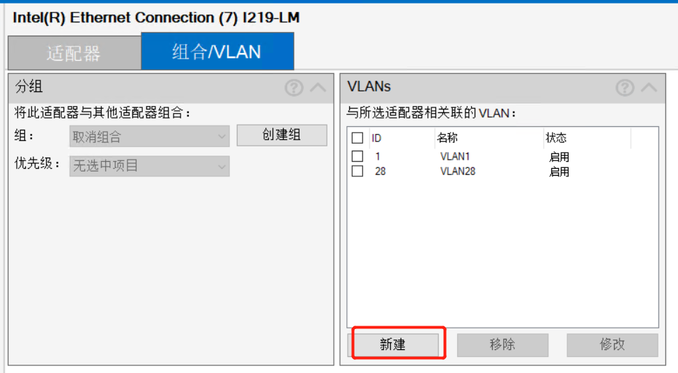
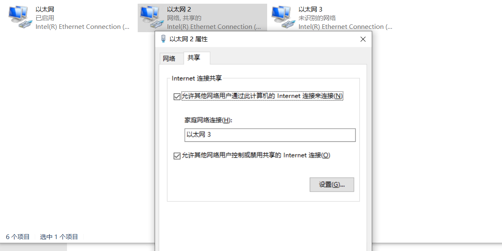

# 需要windows程序验证网络多设备共享上网单网卡方案

## 背景

实验室的网口通过DHCP获取IP之后无法直接上网，必须通过一个验证程序之后才能上网，且验证账号只能登陆一台主机，这样笔记本和台式机同时只有一台可以上网，非常麻烦。如果主机有双网卡的话，可以在这台主机上开启网络共享，加一个交换机或者路由器，让更多的设备同时上网。

## 双网卡方案

参见下图拓扑，在一台双网卡的windows主机上运行验证程序，然后把外网网卡共享给第二张网卡使用，第二张网卡再接交换机，可以实现多设备的上网。这个方案的好处是设置简单，且非常容易理解。缺点是需要花钱额外买一张网卡。另外第二网卡也可以选择使用无线网卡，windows直接开启热点（WIN10）或者使用WIFI共享大师这类软件，笔记本和手机可以通过WIFI连接到热点。这也是本人最早采用的方案，但是可能是使用的usb无线网卡方案不太优秀，经常丢WIFI，无奈放弃了。直到某一天，突然灵机一动，想到一个只需要一张物理网卡就能实现的方案。

## 单网卡方案

这个方案需要一台可以划分vlan的交换机（或者路由器）VLAN的解释。本人选择了一台刷了OPENWRT的无线路由器。先看拓扑图如下，通过在交换机上划分两个vlan（VLAN1，VLAN28)隔离原来的物理网络和内部小局域网，VLAN28相当于双网卡方案外网网卡到网口部分的网络，VLAN1相当于网卡2到无线路由器部分的网络。windows主机上开两个vlan（1、28），

### 路由器配置

“openwrt”–>“网络”–>“交换机”页面，新增一个id为28的vlan，如具体设置见下图。几点说明：

- CPU(ETH0):所有vlan都必须选tagged
- LAN1：作为trunk口传输VLAN1和VLAN28的数据，VLAN1和28选tagged，其余关闭；LAN1口网线接到windows台式机
- LAN4：untaged vlan28，从这个口进来的数据包会封装上vlan28的tag；LAN4口网线接外网网口
- LAN2/3口作为普通口用，接其他需要上网的设备

“网络”–>“接口”页面: 选择接口LAN，修改，IP地址设置为静态192.168.137.2，网关修改为192.168.137.1

### WINDOWS主机配置

windows需要新增两个vlan虚机网卡，id分别为1和28，各个方案的网卡需要安装不同的官方驱动来添加vlan，下面以intel网卡为例

1. 安装 Intel(R) PROSet Adapter Configuration Utility并右键管理员方式打开

2. 按下图添加两个VLAN（1和28）

   

3. 网络适配器页面可以看到多了两个虚拟网卡：

4. 其中vlan28设置共享，右键点击 以太网2，属性–>共享–>允许其他网络用户…–>选择以太网3（vlan1），完成后以太网3的IP会自动设置为192.168.137.1

完成这些设置之后，先确认台式机可以使用验证登录上网了，验证通过后其他的设备就可以上网了